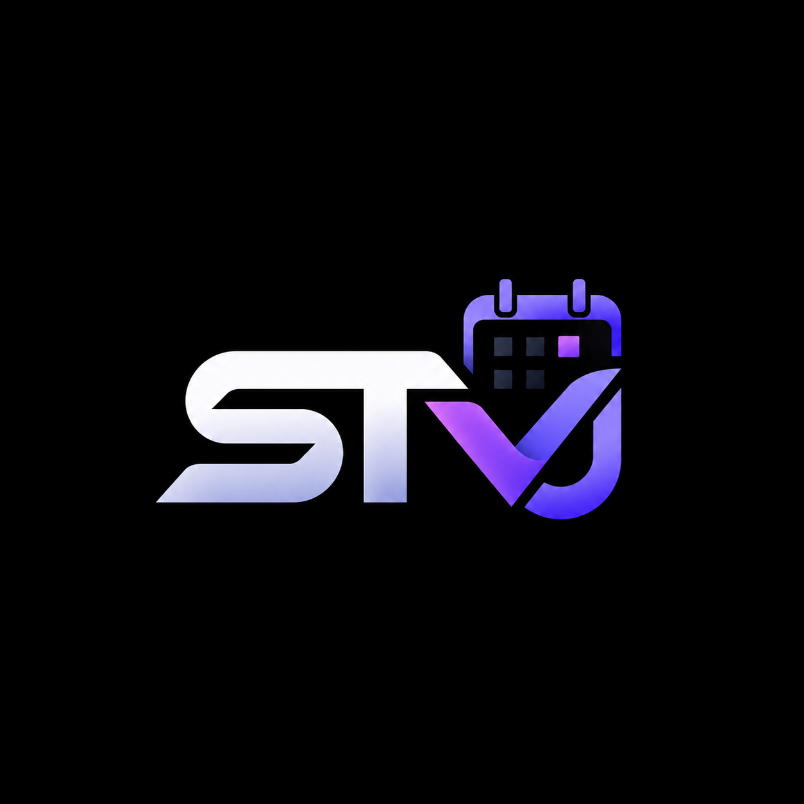

<div align="center">

  

  # STrakvu

  ### Developer Activity Timeline & Calendar

  **Track your development activity across projects, organized by time, date, and repository.**

  [](https://opensource.org/licenses/MIT)
  [](https://github.com/sanjayanand0509/strakvu/stargazers)
  [](https://github.com/sanjayanand0509/strakvu/network)
  [](https://github.com/sanjayanand0509/strakvu)

  <br />

  <p align="center">
    STrakvu is an open-source <b>developer activity tracker and development timeline</b> built to give developers a clearer, unified view of what they worked on and when.
  </p>

</div>

---

### 💡 What is STrakvu?

Instead of scattered activity across individual GitHub repositories, STrakvu brings development activity into a **calendar and timeline experience**.

STrakvu is being built as a **developer activity calendar** that turns GitHub activity into an organized visual history.

Connect your GitHub account, view activity by date, and explore what happened throughout your development day down to the minute.

```
GitHub activity ──▶ Interactive Calendar ──▶ Daily Timeline ──▶ Development History
```

---

### 🔎 Built for Modern Developers

STrakvu is designed around the reality of how software is actually built today:

* 🐙 **GitHub** for code, pushes, PRs, and commits
* 🤖 **AI Tools** (Claude, ChatGPT, Gemini, Cursor) for ideas, prompts, and problem solving
* 💻 **IDEs** for writing and refactoring code
* 🌐 **Browsers** for technical documentation and research
* 🚀 **Deployment Platforms** for shipping projects to production

These activities are normally scattered across different browser tabs and tools.

**STrakvu aims to bring them together into one seamless development timeline.**

---

### ✨ Core Capabilities

* 📅 **Full Month & Year Calendar View** — Inspect your coding rhythms, commit density, and focus projects across any date.
* ⚡ **Live GitHub Activity & Commits** — Sync real commit hashes, messages, branches, and diff summaries directly from your repositories.
* 📖 **Developer Story** — Automatically synthesizes what was built on each date from your day's commit history.
* 🧠 **AI Prompt & Context Logging** — Capture prompts, snippets, and problem-solving sessions from Claude, ChatGPT, Gemini, or Cursor attached to the specific project and day.
* 📊 **Rhythm & Velocity Metrics** — Track your daily coding streak, top repositories, and active days.

---

### 🚀 Current Direction

The current foundation focuses on **GitHub activity and calendar-based development history**.

Future versions are planned to explore integrations with:
- 🔌 Direct IDE extensions (VS Code, Cursor, JetBrains)
- 🤖 Automated AI conversation sync
- 🌐 Browser research history for developer documentation
- 🚢 Deployment webhooks and release milestones
- 📈 Comprehensive multi-year developer growth analytics

> **STrakvu is actively being built. More features and integrations are rolling out. Stay tuned.**

---

### ⭐ Open Source & Community

STrakvu is being developed openly for the developer community.

If you find the idea useful or interesting:

* ⭐ **Star the repository** to support the project and follow updates.
* 🍴 **Fork it** and experiment with it.
* 💡 **Open an issue** with ideas, feedback, or feature requests.
* 🤝 **Contributions are welcome** as STrakvu grows.

---

<div align="center">

  **STrakvu — Your development activity, one timeline.**

  <sub>Crafted for developers everywhere.</sub>

</div>
